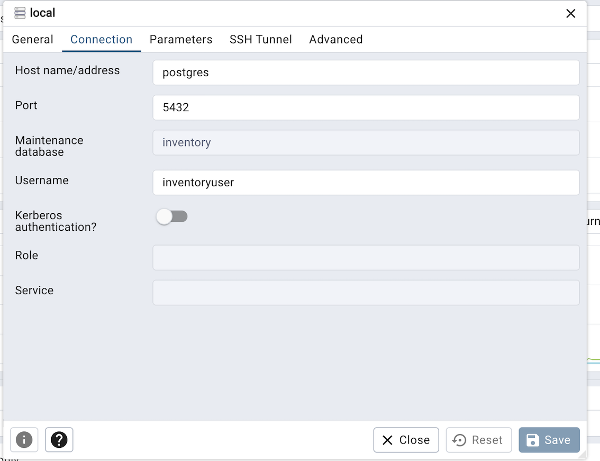

# Procesamiento Importación de Archivos Planos

### Requerimientos

* [Java 21](https://www.oracle.com/java/technologies/downloads/#jdk21-linux)
* [Maven](https://maven.apache.org/download.cgi)
* [Docker](https://docs.docker.com/compose/install)

### Pasos para Despliegue
Usar una terminal de comandos:
* Construir el artefacto del sistema e imagen Docker (*ntapia/item-importer-service*):
```
$ ./scripts/build.sh
```
* Crear contenedores:
```
$ ./scripts/deploy.sh
```

Este comando creará tres contenedores:
1. Base de datos Postgres.
2. Client Web UI para la base de datos.
3. Servicio REST para el procesamiento de archivos.

### Usar el Endpoint del Servicio

Para usar el endpoint podemos enviar los siguientes valores:

| Campo     | Descripción                                                         |
|-----------|---------------------------------------------------------------------|
| fileFormat| Define el formato a procesas. Valores soportados CSV y JSON_LINES   |
| encoding | Character encoding utilicado en el archivo                          |
| separator| Define el caracter utilizado en el archivo para separar los valores |
| file| Define la URL del archivo a procesar                                |

```
curl --location 'http://localhost:8181/v1/items/import' \
--form 'fileFormat="CSV"' \
--form 'encoding="UTF-8"' \
--form 'separator=","' \
--form 'file=@"/Users/userpath/files/file_to_import.csv"'
```

### Usar el Client Web UI para la base de datos

* Para usar el cliente debe utilizar un navegador web y utilizar la URL:
`http://localhost:8888/`

* Se debe utilizar los datos de login definidos en el archivo [docker-compose.yml](docker-compose.yml)

`PGADMIN_DEFAULT_EMAIL`
`PGADMIN_DEFAULT_PASSWORD`

* Se debe registrar una conexión. Utilizar la opción *Add new server*

  

Utilizar los datos definidos en el archivo [docker-compose.yml](docker-compose.yml)
  `POSTGRES_PASSWORD`
  `POSTGRES_USER`
  `POSTGRES_DB`

### Troubleshooting

* Habilitar permiso de ejecución a los scrips:
```
$ chmod 744 scripts/build.sh scripts/deploy.sh scripts/destroy.sh
```

* Habilitar SSH para el uso del API de Mercadolibre:

1. Descargar certificado de seguridad de mercadolibre.com
2. Copiar certificado con el nombre `mercadolibre.com.cer` en el root del proyecto.
3. Ejecurar el script `$ ./scripts/build-truststore.sh`
4. Remover comentario (#) del archivo [docker-compose.yml](docker-compose.yml) línea 10
4. Ejecurar el script `$ ./scripts/build.sh`
4. Ejecurar el script `$ ./scripts/deploy.sh`
